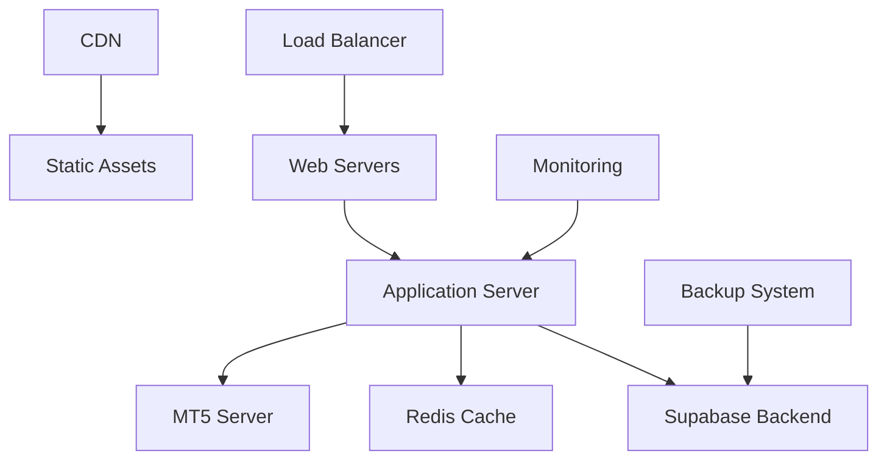

# Deployment Guide

Complete deployment guide for the AonePrime FX Trading Platform across different environments and hosting providers.

## 📋 Table of Contents

- [Deployment Overview](#deployment-overview)
- [Production Deployment](#production-deployment)
- [Docker Deployment](#docker-deployment)
- [Cloud Platforms](#cloud-platforms)
- [CI/CD Pipeline](#cicd-pipeline)
- [Monitoring & Logging](#monitoring--logging)
- [Security Considerations](#security-considerations)

## 🌐 Deployment Overview

### Architecture Overview


### Deployment Environments

#### Development
- **Purpose**: Local development and testing
- **Resources**: Minimal (laptop/desktop)
- **Database**: Local Supabase project
- **Monitoring**: Basic console logging

#### Staging
- **Purpose**: Pre-production testing and QA
- **Resources**: Moderate (shared server)
- **Database**: Staging Supabase project
- **Monitoring**: Basic metrics and logging

#### Production
- **Purpose**: Live user-facing environment
- **Resources**: High availability, auto-scaling
- **Database**: Production Supabase project
- **Monitoring**: Comprehensive monitoring and alerting

## 🚀 Production Deployment

### Prerequisites

#### System Requirements
```bash
# Minimum Production Requirements
CPU: 4 cores (3.0 GHz)
RAM: 8 GB
Storage: 100 GB SSD
Network: 1 Gbps
OS: Ubuntu 20.04 LTS or similar

# Recommended Production Requirements
CPU: 8 cores (3.5 GHz)
RAM: 16 GB
Storage: 200 GB SSD
Network: 10 Gbps
Load Balancer: Yes
CDN: Yes
```

### Step 1: Server Preparation

#### Update System
```bash
# Update system packages
sudo apt update && sudo apt upgrade -y

# Install essential packages
sudo apt install -y curl wget git nginx certbot python3-certbot-nginx

# Install Node.js 18+
curl -fsSL https://deb.nodesource.com/setup_18.x | sudo -E bash -
sudo apt install -y nodejs

# Verify installation
node --version
npm --version
```

#### Create Application User
```bash
# Create application user
sudo useradd -m -s /bin/bash aoneprime
sudo usermod -aG sudo aoneprime

# Switch to application user
sudo su - aoneprime
```

### Step 2: Application Setup

#### Clone and Build Application
```bash
# Clone repository
git clone <repository-url> /home/aoneprime/app
cd /home/aoneprime/app

# Install dependencies
npm ci --only=production

# Build application
npm run build

# Verify build
ls -la dist/
```

#### Environment Configuration
```bash
# Create production environment file
cat > .env.production << EOF
NODE_ENV=production
VITE_APP_ENV=production
VITE_APP_VERSION=1.0.0

# Supabase Configuration
VITE_SUPABASE_URL=https://your-production-project.supabase.co
VITE_SUPABASE_ANON_KEY=your-production-anon-key

# Domain Configuration
VITE_DOMAIN=https://aoneprimefx.com
VITE_API_URL=https://api.aoneprimefx.com

# CDN Configuration
VITE_CDN_URL=https://cdn.aoneprimefx.com

# Security
VITE_SECURE_COOKIES=true
VITE_ENFORCE_HTTPS=true
EOF
```

### Step 3: Web Server Configuration

#### Nginx Configuration
```nginx
# /etc/nginx/sites-available/aoneprimefx.com
server {
    listen 80;
    server_name aoneprimefx.com www.aoneprimefx.com;
    return 301 https://$server_name$request_uri;
}

server {
    listen 443 ssl http2;
    server_name aoneprimefx.com www.aoneprimefx.com;
    
    # SSL Configuration
    ssl_certificate /etc/letsencrypt/live/aoneprimefx.com/fullchain.pem;
    ssl_certificate_key /etc/letsencrypt/live/aoneprimefx.com/privkey.pem;
    ssl_protocols TLSv1.2 TLSv1.3;
    ssl_ciphers ECDHE-RSA-AES128-GCM-SHA256:ECDHE-RSA-AES256-GCM-SHA384;
    
    # Security Headers
    add_header Strict-Transport-Security "max-age=31536000; includeSubDomains" always;
    add_header X-Content-Type-Options nosniff always;
    add_header X-Frame-Options DENY always;
    add_header X-XSS-Protection "1; mode=block" always;
    add_header Referrer-Policy "strict-origin-when-cross-origin" always;
    
    # Document Root
    root /home/aoneprime/app/dist;
    index index.html;
    
    # Gzip Compression
    gzip on;
    gzip_vary on;
    gzip_min_length 1024;
    gzip_types text/plain text/css text/xml text/javascript application/javascript application/xml+rss application/json;
    
    # Static Assets with Long Cache
    location ~* \.(js|css|png|jpg|jpeg|gif|ico|svg|woff|woff2|ttf|eot)$ {
        expires 1y;
        add_header Cache-Control "public, immutable";
        access_log off;
    }
    
    # API Proxy
    location /api/ {
        proxy_pass https://rxdyudnjbnnvhbxwkcbf.supabase.co/rest/v1/;
        proxy_set_header Host $host;
        proxy_set_header X-Real-IP $remote_addr;
        proxy_set_header X-Forwarded-For $proxy_add_x_forwarded_for;
        proxy_set_header X-Forwarded-Proto $scheme;
    }
    
    # WebSocket Proxy for Real-time
    location /realtime/ {
        proxy_pass https://rxdyudnjbnnvhbxwkcbf.supabase.co/realtime/;
        proxy_http_version 1.1;
        proxy_set_header Upgrade $http_upgrade;
        proxy_set_header Connection "upgrade";
        proxy_set_header Host $host;
        proxy_set_header X-Real-IP $remote_addr;
    }
    
    # SPA Routing
    location / {
        try_files $uri $uri/ /index.html;
    }
    
    # Security: Block access to sensitive files
    location ~ /\. {
        deny all;
        access_log off;
        log_not_found off;
    }
}
```

#### Enable Site
```bash
# Enable site
sudo ln -s /etc/nginx/sites-available/aoneprimefx.com /etc/nginx/sites-enabled/

# Test configuration
sudo nginx -t

# Restart nginx
sudo systemctl restart nginx
sudo systemctl enable nginx
```

### Step 4: SSL Certificate

#### Let's Encrypt SSL
```bash
# Obtain SSL certificate
sudo certbot --nginx -d aoneprimefx.com -d www.aoneprimefx.com

# Set up automatic renewal
sudo crontab -e
# Add: 0 12 * * * /usr/bin/certbot renew --quiet
```

### Step 5: Process Management

#### PM2 Configuration (Optional for SSR)
```bash
# Install PM2 globally
sudo npm install -g pm2

# Create PM2 configuration
cat > ecosystem.config.js << EOF
module.exports = {
  apps: [{
    name: 'aoneprime-fx',
    script: 'npm',
    args: 'run preview',
    cwd: '/home/aoneprime/app',
    env: {
      NODE_ENV: 'production',
      PORT: 3000
    },
    instances: 'max',
    exec_mode: 'cluster',
    watch: false,
    max_memory_restart: '1G',
    error_file: '/var/log/aoneprime/error.log',
    out_file: '/var/log/aoneprime/out.log',
    log_file: '/var/log/aoneprime/combined.log',
    time: true
  }]
};
EOF

# Start application
pm2 start ecosystem.config.js

# Save PM2 configuration
pm2 save

# Set up PM2 startup
pm2 startup
```

## 🐳 Docker Deployment

### Docker Configuration

#### Dockerfile
```dockerfile
# Multi-stage build for production
FROM node:18-alpine AS builder

WORKDIR /app
COPY package*.json ./
RUN npm ci --only=production && npm cache clean --force

COPY . .
RUN npm run build

# Production stage
FROM nginx:alpine AS production

# Install security updates
RUN apk update && apk upgrade && apk add --no-cache curl

# Copy built application
COPY --from=builder /app/dist /usr/share/nginx/html

# Copy nginx configuration
COPY nginx.conf /etc/nginx/nginx.conf

# Health check
HEALTHCHECK --interval=30s --timeout=3s --start-period=5s --retries=3 \
  CMD curl -f http://localhost/ || exit 1

EXPOSE 80

CMD ["nginx", "-g", "daemon off;"]
```

#### Docker Compose
```yaml
# docker-compose.prod.yml
version: '3.8'

services:
  app:
    build:
      context: .
      dockerfile: Dockerfile
      target: production
    ports:
      - "80:80"
      - "443:443"
    environment:
      - NODE_ENV=production
    volumes:
      - ./ssl:/etc/nginx/ssl:ro
      - ./logs:/var/log/nginx
    restart: unless-stopped
    healthcheck:
      test: ["CMD", "curl", "-f", "http://localhost/"]
      interval: 30s
      timeout: 10s
      retries: 3
    networks:
      - aoneprime-network

  redis:
    image: redis:alpine
    command: redis-server --appendonly yes
    volumes:
      - redis-data:/data
    restart: unless-stopped
    networks:
      - aoneprime-network

networks:
  aoneprime-network:
    driver: bridge

volumes:
  redis-data:
```

#### Deploy with Docker
```bash
# Build and deploy
docker-compose -f docker-compose.prod.yml up -d

# Check status
docker-compose -f docker-compose.prod.yml ps

# View logs
docker-compose -f docker-compose.prod.yml logs -f
```

## ☁️ Cloud Platforms

### Vercel Deployment

#### Configuration
```json
// vercel.json
{
  "version": 2,
  "builds": [
    {
      "src": "package.json",
      "use": "@vercel/static-build",
      "config": {
        "distDir": "dist"
      }
    }
  ],
  "routes": [
    {
      "src": "/(.*)",
      "dest": "/index.html"
    }
  ],
  "env": {
    "VITE_SUPABASE_URL": "@supabase_url",
    "VITE_SUPABASE_ANON_KEY": "@supabase_anon_key"
  },
  "headers": [
    {
      "source": "/(.*)",
      "headers": [
        {
          "key": "X-Content-Type-Options",
          "value": "nosniff"
        },
        {
          "key": "X-Frame-Options",
          "value": "DENY"
        },
        {
          "key": "X-XSS-Protection",
          "value": "1; mode=block"
        }
      ]
    }
  ]
}
```

#### Deploy to Vercel
```bash
# Install Vercel CLI
npm install -g vercel

# Login to Vercel
vercel login

# Deploy
vercel --prod
```

### Netlify Deployment

#### Configuration
```toml
# netlify.toml
[build]
  publish = "dist"
  command = "npm run build"

[build.environment]
  NODE_VERSION = "18"

[[redirects]]
  from = "/*"
  to = "/index.html"
  status = 200

[[headers]]
  for = "/*"
  [headers.values]
    X-Frame-Options = "DENY"
    X-XSS-Protection = "1; mode=block"
    X-Content-Type-Options = "nosniff"
    Strict-Transport-Security = "max-age=31536000; includeSubDomains"

[[headers]]
  for = "/static/*"
  [headers.values]
    Cache-Control = "public, max-age=31536000, immutable"
```

### AWS Deployment

#### S3 + CloudFront Setup
```bash
# Create S3 bucket
aws s3 mb s3://aoneprimefx-com

# Upload build files
aws s3 sync dist/ s3://aoneprimefx-com --delete

# Configure bucket for static website hosting
aws s3 website s3://aoneprimefx-com --index-document index.html --error-document index.html
```

#### CloudFront Distribution
```json
{
  "CallerReference": "aoneprimefx-distribution",
  "Comment": "AonePrime FX CDN Distribution",
  "DefaultRootObject": "index.html",
  "Origins": {
    "Quantity": 1,
    "Items": [
      {
        "Id": "S3-aoneprimefx-com",
        "DomainName": "aoneprimefx-com.s3.amazonaws.com",
        "S3OriginConfig": {
          "OriginAccessIdentity": ""
        }
      }
    ]
  },
  "DefaultCacheBehavior": {
    "TargetOriginId": "S3-aoneprimefx-com",
    "ViewerProtocolPolicy": "redirect-to-https",
    "MinTTL": 0,
    "ForwardedValues": {
      "QueryString": false,
      "Cookies": {
        "Forward": "none"
      }
    }
  }
}
```

## 🔄 CI/CD Pipeline

### GitHub Actions

#### Build and Test Workflow
```yaml
# .github/workflows/ci.yml
name: CI/CD Pipeline

on:
  push:
    branches: [ main, develop ]
  pull_request:
    branches: [ main ]

jobs:
  test:
    runs-on: ubuntu-latest
    
    steps:
    - uses: actions/checkout@v3
    
    - name: Setup Node.js
      uses: actions/setup-node@v3
      with:
        node-version: '18'
        cache: 'npm'
    
    - name: Install dependencies
      run: npm ci
    
    - name: Run linter
      run: npm run lint
    
    - name: Run type check
      run: npm run type-check
    
    - name: Run tests
      run: npm run test
    
    - name: Build application
      run: npm run build
      env:
        VITE_SUPABASE_URL: ${{ secrets.SUPABASE_URL }}
        VITE_SUPABASE_ANON_KEY: ${{ secrets.SUPABASE_ANON_KEY }}

  deploy:
    needs: test
    runs-on: ubuntu-latest
    if: github.ref == 'refs/heads/main'
    
    steps:
    - uses: actions/checkout@v3
    
    - name: Setup Node.js
      uses: actions/setup-node@v3
      with:
        node-version: '18'
        cache: 'npm'
    
    - name: Install dependencies
      run: npm ci
    
    - name: Build for production
      run: npm run build
      env:
        VITE_SUPABASE_URL: ${{ secrets.PROD_SUPABASE_URL }}
        VITE_SUPABASE_ANON_KEY: ${{ secrets.PROD_SUPABASE_ANON_KEY }}
    
    - name: Deploy to production
      run: |
        # Add your deployment script here
        echo "Deploying to production..."
```

#### Production Deployment Workflow
```yaml
# .github/workflows/deploy.yml
name: Production Deployment

on:
  workflow_dispatch:
  push:
    tags:
      - 'v*'

jobs:
  deploy:
    runs-on: ubuntu-latest
    
    steps:
    - uses: actions/checkout@v3
    
    - name: Build and Deploy
      run: |
        # Build Docker image
        docker build -t aoneprimefx:${{ github.sha }} .
        
        # Push to registry
        docker tag aoneprimefx:${{ github.sha }} registry.example.com/aoneprimefx:latest
        docker push registry.example.com/aoneprimefx:latest
        
        # Deploy to production
        ssh production-server "docker pull registry.example.com/aoneprimefx:latest && docker-compose up -d"
```

## 📊 Monitoring & Logging

### Application Monitoring

#### Health Check Endpoint
```javascript
// Health check endpoint
app.get('/health', (req, res) => {
  const healthCheck = {
    uptime: process.uptime(),
    message: 'OK',
    timestamp: Date.now(),
    checks: {
      database: 'OK', // Check Supabase connection
      redis: 'OK',     // Check Redis connection
      mt5: 'OK'        // Check MT5 connection
    }
  };
  
  res.status(200).json(healthCheck);
});
```

#### Prometheus Metrics
```javascript
const prometheus = require('prom-client');

// Create metrics
const httpRequestDuration = new prometheus.Histogram({
  name: 'http_request_duration_seconds',
  help: 'Duration of HTTP requests in seconds',
  labelNames: ['method', 'route', 'status_code']
});

const activeUsers = new prometheus.Gauge({
  name: 'active_users_total',
  help: 'Number of active users'
});

const tradingVolume = new prometheus.Counter({
  name: 'trading_volume_total',
  help: 'Total trading volume'
});
```

### Log Management

#### Structured Logging
```javascript
const winston = require('winston');

const logger = winston.createLogger({
  level: 'info',
  format: winston.format.combine(
    winston.format.timestamp(),
    winston.format.errors({ stack: true }),
    winston.format.json()
  ),
  defaultMeta: { service: 'aoneprime-fx' },
  transports: [
    new winston.transports.File({ filename: 'logs/error.log', level: 'error' }),
    new winston.transports.File({ filename: 'logs/combined.log' })
  ]
});

// Add console logging in development
if (process.env.NODE_ENV !== 'production') {
  logger.add(new winston.transports.Console({
    format: winston.format.simple()
  }));
}
```

#### Log Aggregation
```yaml
# docker-compose.monitoring.yml
version: '3.8'

services:
  elasticsearch:
    image: docker.elastic.co/elasticsearch/elasticsearch:8.5.0
    environment:
      - discovery.type=single-node
    ports:
      - "9200:9200"
    volumes:
      - elasticsearch-data:/usr/share/elasticsearch/data

  logstash:
    image: docker.elastic.co/logstash/logstash:8.5.0
    ports:
      - "5000:5000"
    volumes:
      - ./logstash.conf:/usr/share/logstash/pipeline/logstash.conf

  kibana:
    image: docker.elastic.co/kibana/kibana:8.5.0
    ports:
      - "5601:5601"
    environment:
      - ELASTICSEARCH_HOSTS=http://elasticsearch:9200

volumes:
  elasticsearch-data:
```

## 🔒 Security Considerations

### Production Security Checklist

#### Application Security
- [ ] Enable HTTPS everywhere
- [ ] Configure proper CORS headers
- [ ] Implement rate limiting
- [ ] Set up security headers (CSP, HSTS, etc.)
- [ ] Validate all user inputs
- [ ] Use parameterized queries
- [ ] Implement proper error handling
- [ ] Secure API endpoints with authentication

#### Infrastructure Security
- [ ] Keep all systems updated
- [ ] Use strong passwords and SSH keys
- [ ] Configure firewall rules
- [ ] Implement network segmentation
- [ ] Set up intrusion detection
- [ ] Regular security audits
- [ ] Backup and recovery procedures
- [ ] Monitor access logs

#### Database Security
```sql
-- Create read-only user for monitoring
CREATE USER monitoring_user WITH PASSWORD 'secure_password';
GRANT SELECT ON ALL TABLES IN SCHEMA public TO monitoring_user;

-- Create backup user with minimal privileges
CREATE USER backup_user WITH PASSWORD 'backup_password';
GRANT SELECT ON ALL TABLES IN SCHEMA public TO backup_user;
```

### Environment Variables Security
```bash
# Use secrets management for sensitive data
# Never commit .env files to version control

# Example: AWS Secrets Manager
aws secretsmanager get-secret-value --secret-id aoneprime/prod/database --query SecretString --output text
```

---

**Successful deployment requires careful planning, proper security measures, and ongoing monitoring. Always test thoroughly in staging before deploying to production.**